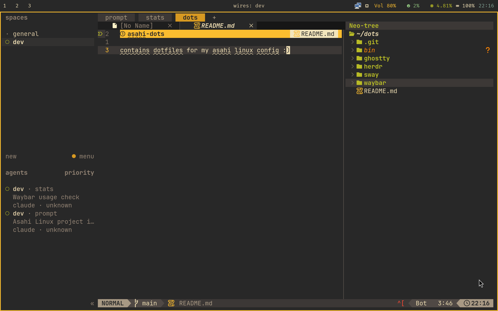

# asahi-dots

contains dotfiles for my asahi linux config :)



how to replicate the setup:

```sh
git clone https://github.com/abhinavborah/asahi-dots ~/dots
cd ~/dots
stow -n -v */    # dry run
stow */
```

packages required:

```
stow sway waybar rofi grim slurp wl-clipboard libnotify network-manager-applet brightnessctl rofi
```
